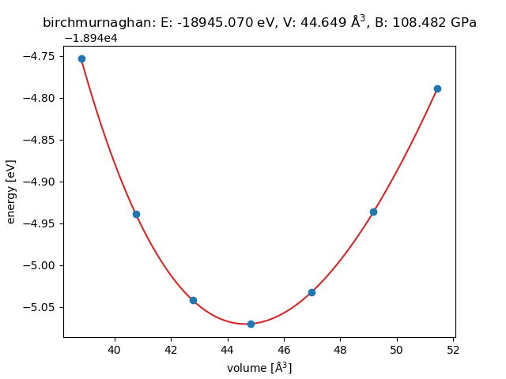

# DFT_exercise

Quantum ESPRESSO(`pw.x`) 및 ASE(Atomic Simulation Environment)를 활용한 밀도범함수이론(DFT) 계산 실습 및 물성 분석 아카이브입니다.

---

## Exercise 02: Hf (Hafnium) HCP Lattice Parameter Optimization

하프늄(Hf)의 육방밀집(HCP) 구조에 대해 격자상수($a$)를 스위프하며 총에너지를 계산하고, **Birch-Murnaghan 3차 상태방정식(EOS)** 피팅을 통해 바닥 상태 격자상수($a_0, c_0$)와 체적탄성률($B_0$)을 도출했습니다.

### 1. 계산 결과 및 실험값 비교 ($c/a = 1.58$ 고정)

| 물리량 (Property) | DFT 예측값 (Calculated) | 실험값 (Experimental) | 오차율 (Error) |
| :--- | :---: | :---: | :---: |
| **격자상수 $a_0$** | **3.1956 Å** | 3.1960 Å | **< 0.02%** |
| **격자상수 $c_0$** | **5.0491 Å** | 5.0510 Å | **0.04%** |
| **평형 부피 $V_0$** | **44.649 ų** | - | - |
| **체적탄성률 $B_0$** | **108.48 GPa** | ~108 - 110 GPa | **< 1.5%** |

### 2. Birch-Murnaghan 상태방정식 피팅 곡선

### 3. 디렉터리 구성
- `ex02_hf_hcp/make_inputs_ase.py`: ASE 기반 7개 격자 스위프 입력 파일(`*.in`) 자동 생성 스크립트
- `ex02_hf_hcp/fit_eos.py`: QE 출력 파일(`*.out`) 파싱 및 Birch-Murnaghan 피팅 스크립트
